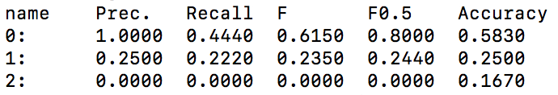

# Go-To-Scorer

Code for the [paper](https://www.aclweb.org/anthology/2020.coling-main.188/): "Taking the Correction Difficulty into Account in Grammatical Error Correction Evaluation". (In COLING 2020) 

Our tools named Go-To-Scorer(GTS) can evaluate the GEC system performance considered the difficulty of error correction. In addition, GTS provides visualizer of error correction difficulty, the  evaluation function using the weight-file, and a function for computing the difficulty of each error type.

### Usage

```bash
python3 gotoscorer.py -ref <ref_m2_path> -hyp <hyp_m2_path>
```

`-ref <ref_m2_path> ` represents a correction of correct answer and `-hyp <hyp_m2_path> ` represents corrections of system．The format of each file is M2, which is generated by [ERRANT](https://github.com/chrisjbryant/errant). You can see `demo/ref.m2` and `demo/hyp.m2` for an example.

each oprions is required.

### Other options

* `-sys_name <sys_1,sys_2,...,sys_N>` 

  Register system names for output to convert id to specified . Separate each name with comma.

* `-heat <output_file_path>`

  Generate a visualizer of error correction difficulty. The visualizer corresponds to Figure 1 in the paper, like heat-map. You can see `demo/heat_map.html` for an example.

* `-cat <output_file_path>`

  Compute mean and standard deviation of each error type difficulty in descending order. It corresponds to Table 4 in the paper. You can see `demo/error_type_difficulty.txt` for an example.

* `-gen_w_file <output_file_path>`

  Generate weight-file. The format is total number of systems in the first row, and number of correct systems for each chunk in the second and subsequent line. You can see `demo/weight.txt` for an example.

* `-w_file <weight_file_path>`

  Evaluate systems for using [weight-file](https://github.com/gotutiyan/GTS/tree/master/weight_files).  This function is for evaluating system in isolation. 
  
* `-chunk_visualizer <file_path>`

  Visualize the chunk as shown in the following example. If `None` is specified as the path of the file, it will be output to the terminal.

  ```
  orig: ||We|         |discussing||about||its||.||
  gold: ||We|have been|discussing||     ||it ||.||
  
  orig: ||I||have been||to|   |park||tomorrow||.||
  gold: ||I||   go    ||to|the|park||        ||.||
  ```

### Demo

`python3 gotoscorer.py -ref demo/ref.m2 -hyp demo/hyp.m2 ` 

Output：



### Generating and format of input files

Using GTS requires 2 files, each format is M^2 generated by [ERRANT](https://github.com/chrisjbryant/errant). 

**Example for using demo data**

* Generating `demo/hyp.m2`

 `errant_parallel -orig demo/orig.txt -cor demo/sys1.txt demo/sys2.txt demo/sys3.txt -out demo/hyp.m2`

* enerating `demo/ref.m2`

`errant_parallel -orig demo/orig.txt -cor demo/gold.txt -out demo/ref.m2`

### Visualizer of error correction difficulty

GTS provides a visualizer of error correction difficulty.
Errors are colored according to the success rate: pale (easiest) to deep (hardest).  Furthermore, the red indicates that system has corrected what should be corrected, and blue indicates that system has corrected what should not be corrected. If you mouseover colored words, you can see the detail of the correction: error type, correct correction, weight.


