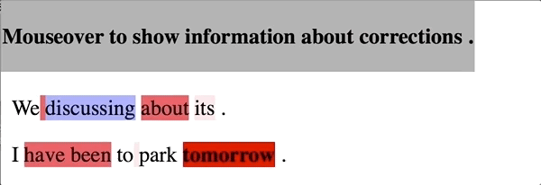

# Go-To-Scorer

本リポジトリは，「訂正難易度を考慮した文法誤り訂正のための性能評価尺度」（言語処理学会第26回年次大会）のツールである．

### 概要

本ツールは，文法誤り訂正タスクの性能評価を行うものである．特に，訂正難易度を考慮した性能評価を行える点が特徴である．

また，訂正難易度の可視化，誤りの種類別の訂正難易度の集計，訂正難易度データの生成，訂正難易度データを用いた性能評価の機能を提供する．

### 実行要件

python 3.6 以上

### 文法

```bash
python3 gotoscorer.py -ref <ref_m2> -hyp <hyp_m2> -sys_name <sys_1,sys_2,...,sys_N> 
```

`-ref <ref_m2>`は正解の訂正を表すファイル，`-hyp <hyp_m2>`はシステムの訂正を表すファイルである．各入力ファイルの例は，`demo/ref.m2`および`demo/hyp.m2`を参照．

`-sys_name <sys_1,sys_2,...,sys_N>`は，システム名を登録するためのオプションである．システム名はカンマ区切りで，スペースを空けずに指定する．システム名は性能評価値を出力する際に使用する．

また，`-ref`， `-hyp` ，`-sys_name`は必須である．

他には，以下のオプションを提供している．

* `-heat <out_file>`

  訂正難易度を可視化したデータを出力する．具体的には，論文中の図1に対応するような，htmlファイルと，それに対応するcssファイルを出力する．出力例は，`demo/heat_map.html`および`demo/heat_map.html.css`を参照．

* `-cat <out_file>`

  誤りの種類ごとに，訂正難易度の平均と標準偏差を降順で出力する．これは論文中の表3に対応する．出力例は，`demo/error_type_difficulty.txt`を参照．

* `-gen_w_file <out_file>`

  重みファイルを出力する．重みファイルのフォーマットは，1行目にシステムの総数，2行目以降は，チャンクごとの正解システム数が記述されている．また，各行が文に対応している．出力例は，`demo/weight.txt`を参照．

* `-w_file <w_file>`

  重みファイルを用いて性能評価を行う．

### デモ

`python3 gotoscorer.py -ref demo/ref.m2 -hyp demo/hyp.m2 -sys_name sys1,sys2,sys3` 

出力例：


タブ区切りで出力される．

詳しくは，[demo](https://github.com/gotutiyan/GTS/tree/master/demo)で記載．

### 入力ファイルのフォーマットと生成

本ツールの入力は2つのファイルであり，いずれもフォーマットはm2形式である．また，いずれも[ERRANT](https://github.com/chrisjbryant/errant)の`errant_parallel`，および`errant_m2`を用いて生成する．

**デモデータを用いた例**

 `errant_parallel -orig demo/orig.txt -cor demo/sys1.txt demo/sys2.txt demo/sys3.txt -out demo/hyp.m2`

`errant_parallel -orig demo/orig.txt -cor demo/gold.txt -out demo/ref.m2`

また，正解の訂正情報がm2形式で既に存在するとき，

`errant_m2 -gold <before_ref_m2_file> -out demo/ref.m2`

を実行する．このようにして得られたファイルを入力として評価を行う．

### 訂正難易度の可視化機能

本ツールでは，`-heat`オプションによって，訂正難易度の可視化機能を提供している．

原文に対して，赤および青で色付けが行われており，いずれも色が濃くなるほど訂正難易度が高いことを表す．また，色付けされた単語列にマウスをかざすことにより，その訂正箇所の(i)誤り種類，(ii)正解単語列，(iii)重み の情報が閲覧できる．



また，赤色は誤り箇所に対するもの，青色はシステムの誤訂正に対するものを表している．この理由から，青色の単語列は，原文自体が正解の単語列となる．よって，上部に表示される(ii)正解単語列 は，原文自体を表示している．