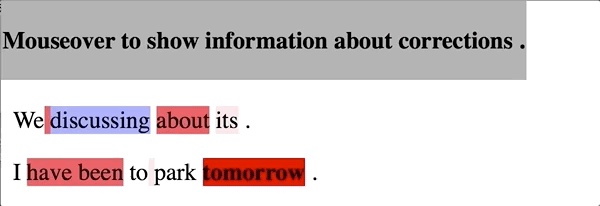

# GoToScorer

本リポジトリは，以下の論文のツールである．

* 五藤巧, 永田亮, 三田雅人, 塙一晃．
  “訂正難易度を考慮した文法誤り訂正のための性能評価尺度．”
  言語処理学会第26回年次大会 (2020.3) [paper](https://www.anlp.jp/proceedings/annual_meeting/2020/pdf_dir/P2-3.pdf)．
  
* Takumi Gotou, Ryo Nagata, Masato Mita and Kazuaki Hanawa
  “Taking the Correction Difficulty into Account in Grammatical Error Correction Evaluation”
  In Proceedings of the 28th International Conference on Computational Linguistics (COLING 2020)  [Link: ACL Anthology](https://www.aclweb.org/anthology/2020.coling-main.188/)
  
  Citation:
  
  ```
  @inproceedings{gotou-etal-2020-taking,
      title = "Taking the Correction Difficulty into Account in Grammatical Error Correction Evaluation",
      author = "Gotou, Takumi  and
        Nagata, Ryo  and
        Mita, Masato  and
        Hanawa, Kazuaki",
      booktitle = "Proceedings of the 28th International Conference on Computational Linguistics",
      month = dec,
      year = "2020",
      address = "Barcelona, Spain (Online)",
      publisher = "International Committee on Computational Linguistics",
      url = "https://aclanthology.org/2020.coling-main.188",
      doi = "10.18653/v1/2020.coling-main.188",
      pages = "2085--2095",
  }
  ```

GoToScorerは，文法誤り訂正タスクの評価のためのツールである．特に，訂正難易度を考慮した評価を行うことが特徴である．また，訂正難易度の可視化や，重みファイルを用いたシステムの単一評価などの機能を提供する．

python3.8での動作を確認済み．

### Usage

```bash
python gotoscorer.py -ref <ref_file> -hyp <hyp_file>
```

`-ref <ref_file> ` はリファレンスのM2ファイル， `-hyp <hyp_file> ` はシステムの訂正結果を示すM2ファイルである． これらのファイルは共に[ERRANT](https://github.com/chrisjbryant/errant)を用いて生成可能である（後述）. 例は `demo/ref.m2` と `demo/hyp.m2`を参照．

### Quick Start

```shell
$ python gotoscorer.py -ref demo/ref.m2 -hyp demo/hyp.m2
```

Output：

```
----- Weighted Scores -----
Sys_name	Prec. 	Recall	F	      F0.5	  Accuracy
0       :	1.0000	0.4444	0.6154	0.8000	0.5833
1       :	0.2500	0.2222	0.2353	0.2439	0.2500
2       :	0.0000	0.0000	0.0000	0.0000	0.1667
```

### Other options

* `-v`

  出力にTP,FP,FN,TNを含める．

  ```shell
  $ python gotoscorer.py -ref demo/ref.m2 -hyp demo/hyp.m2 -v
  ```

  ```
  ----- Weighted Scores -----
  Sys_name	TP      	FP      	FN      	TN      	Prec.	Recall	F	F0.5	Accuracy
  0       :	  1.3333	  0.0000	  1.6667	  1.0000	1.0000	0.4444	0.6154	0.8000	0.5833
  1       :	  0.6667	  2.0000	  2.3333	  0.3333	0.2500	0.2222	0.2353	0.2439	0.2500
  2       :	  0.0000	  2.6667	  3.0000	  0.6667	0.0000	0.0000	0.0000	0.0000	0.1667
  ```

* `-name <sys_1,sys_2,...,sys_N>` 

  出力時に，最も左の列を指定した名前に置き換える．名前はカンマで区切ることで与える．

  ```shell
  $ python gotoscorer.py -ref demo/ref.m2 -hyp demo/hyp.m2 -name CNN,LSTM,Transformer
  ```

  ```
  ----- Weighted Scores -----
  Sys_name   	Prec.	Recall	F	F0.5	Accuracy
  CNN        :	1.0000	0.4444	0.6154	0.8000	0.5833
  LSTM       :	0.2500	0.2222	0.2353	0.2439	0.2500
  Transformer:	0.0000	0.0000	0.0000	0.0000	0.1667
  ```

* `-cat {1,2,3}`

  エラータイプごとの難易度の平均，標準偏差，頻度を出力する．出力は平均に対して降順で出力される．`{1,2,3}`はエラータイプの粒度を表しており，ERRANTと同じように振る舞う．

  ```shell
  $ python gotoscorer.py -ref demo/ref.m2 -hyp demo/hyp.m2 -cat 3
  ```

  ```txt
  ----- Category Difficulty -----
  Category  	Ave.	Std.	Freq.
  U:NOUN    	1.00	0.00	1
  M:VERB    	0.67	0.00	1
  U:PREP    	0.67	0.00	1
  R:VERB    	0.67	0.00	1
  R:PRON    	0.00	0.00	1
  M:DET     	0.00	0.00	1
  ```

* `-heat <output_file>`

  訂正難易度をヒートマップの形式で可視化するhtmlファイルを出力する．例として`demo/heat_map.html`を参照のこと．

  ```shell
  $ python gotoscorer.py -ref demo/ref.m2 -hyp demo/hyp.m2 -heat demo/heat_map.html
  ```

* `-gen_w_file <output_file>`

  重みファイルを出力する．本来，訂正難易度を算出するためには複数システムの出力を必要とするが，事前に作成した重みファイルを用いることで単一システムの評価が可能である．重みファイルの例は`demo/weight.txt`を参照のこと．

  ```shell
  $ python gotoscorer.py -ref demo/ref.m2 -hyp demo/hyp.m2 -gen_w_file demo/weight.txt 
  ```

* `-w_file <weight_file>`

  重みファイルを用いてシステムを評価する．

  ```shell
  $ python gotoscorer.py -ref demo/ref.m2 -hyp demo/hyp_1sys.m2 -w_file demo/weight.txt 
  ```

  ```
  ----- Weighted Scores -----
  Sys_name	Prec.	Recall	F	F0.5	Accuracy
  0       :	1.0000	0.4444	0.6154	0.8000	0.5833
  ```

* `-cv <output_file>`

  チャンクを重みとカテゴリと共に可視化する．出力パスに`None`を指定すると，ターミナルに出力する．

  ```shell
  $ python gotoscorer.py -ref demo/ref.m2 -hyp demo/hyp.m2 -cv None
  ```

  ```
  ----- Chunk Visualizer -----
  orig:   |    |We |         |discussing|   |about |   | its  |   | . |    |
  gold:   |    |We |have been|discussing|   |      |   |  it  |   | . |    |
  weight: |0.33|0.0|  0.67   |   0.33   |0.0| 0.67 |0.0| 0.0  |0.0|0.0|0.33|
  cat:    |    |   | M:VERB  |          |   |U:PREP|   |R:PRON|   |   |    |
  
  orig:   |   | I |   |have been|   |to |     |park|   |tomorrow|   | . |   |
  gold:   |   | I |   |   go    |   |to | the |park|   |        |   | . |   |
  weight: |0.0|0.0|0.0|  0.67   |0.0|0.0| 0.0 |0.0 |0.0|  1.0   |0.0|0.0|0.0|
  cat:    |   |   |   | R:VERB  |   |   |M:DET|    |   | U:NOUN |   |   |   |
  ```

### How to make M2 file

GTSはreference M2とhypothesis M2を必要とする.これらは[ERRANT](https://github.com/chrisjbryant/errant)を用いて生成可能である.

**デモデータを用いた生成例**

*  `demo/hyp.m2`の生成

  ```shell
  $ errant_parallel -orig demo/orig.txt -cor demo/sys1.txt demo/sys2.txt demo/sys3.txt -out demo/hyp.m2
  ```

*  `demo/ref.m2`の生成

  ```shell
  $ errant_parallel -orig demo/orig.txt -cor demo/gold.txt -out demo/ref.m2
  ```

  （一般には，reference M2は提供されたものを用いることが多いため，このように生成することは少ないと思われる．）

### Visualizer of error correction difficulty

GTSは訂正難易度の可視化機能を提供する．

誤り箇所は，その難しさを色の濃淡で示す．淡い色ほど訂正が易しく，濃い色ほど訂正が難しいことを示す．また，訂正すべき誤り箇所を赤色で示し，システムの誤訂正の箇所を青色で示す．色が付いている文字列にマウスをかざすことで，エラータイプ，正解の訂正，重みの情報が表示される．


