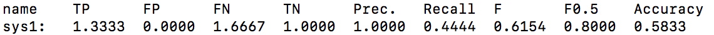

# デモ

* 性能評価値を出力し，訂正難易度可視化のためのhtmlおよびcss(`-heat`)，誤り種類別の訂正難易度を可視化する(`-cat`)．および，訂正難易度データを生成する(`-gen_w_file`)．

  （実行はこのdemoフォルダ内で行うことを仮定）

```bash
python3 ../gotoscorer.py -ref ./ref.m2 -hyp ./hyp.m2 -sys_name system1,system2,system3 -heat ./heat_map.html -cat ./error_type_difficulty.txt -gen_w_file ./weight.txt
```

出力例


* 訂正難易度データを用いて評価を行う．

```bash
python3 ../gotoscorer.py -ref ./ref.m2 -hyp ./w_file_hyp.m2 -sys_name sys1 -w_file ./weight.txt
```

出力例



