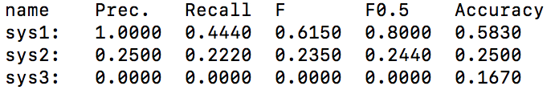
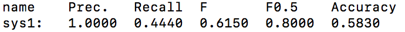

# デモ

* `-sys_name`, `-heat`, `-cat`, `-gen_w_file`は，例えば以下のように使用できる．

  （実行はこのdemoフォルダ内で行うことを仮定）

```bash
python3 ../gotoscorer.py -ref ./ref.m2 -hyp ./hyp.m2 -sys_name sys1,sys2,sys3 -heat ./heat_map.html -cat ./error_type_difficulty.txt -gen_w_file ./weight.txt
```

Output:



* `-w_file`オプションを用いて，重みファイルで評価を行う．

```bash
python3 ../gotoscorer.py -ref ./ref.m2 -hyp ./w_file_hyp.m2 -sys_name sys1 -w_file ./weight.txt
```

出力例



